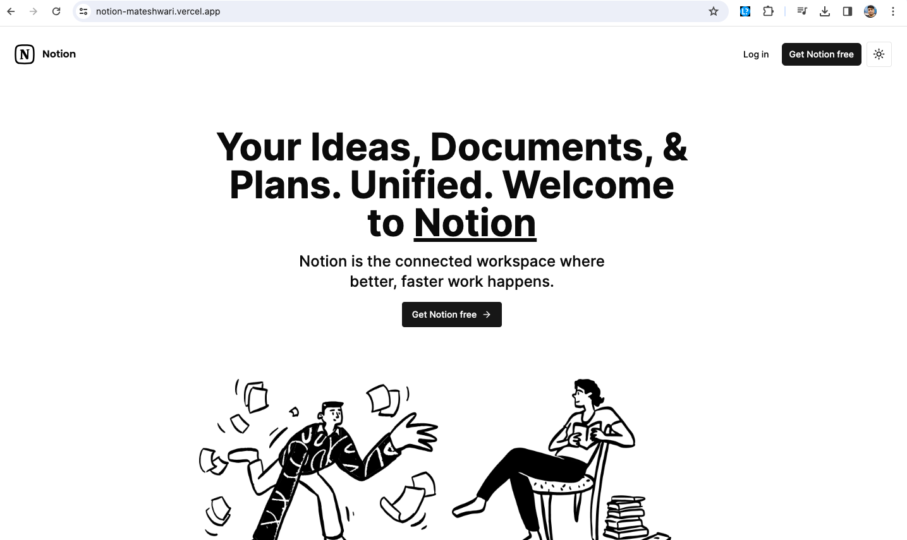

## Fullstack Notion Clone: Next.js 13, React, Convex, Tailwind



This repository houses a full-stack Notion Clone built with Next.js 13, React, Convex, and Tailwind.

## Live: https://notion-mateshwari.vercel.app/
### Key Features

- **Real-time database**: Utilizing real-time database functionality for seamless updates.
- **Notion-style editor**: A user-friendly editor reminiscent of Notion's interface.
- **Light and Dark mode**: Switch between light and dark themes for personalized viewing.
- **Infinite children documents**: Capability to create a hierarchical structure of documents.
- **Trash can & soft delete**: Implementing a trash can feature for soft deletes.
- **Authentication**: Secure user authentication for data privacy.
- **File management**: Including functionalities for file upload, deletion, and replacement.
- **Dynamic icons**: Icons dynamically change for each document, updating in real-time.
- **Expandable sidebar**: Easily navigate with a collapsible sidebar.
- **Full mobile responsiveness**: Ensuring smooth user experience across devices.
- **Publish to web**: Capability to publish notes to the web for sharing.
- **Collapsible sidebar**: Sidebar collapses fully for an unobstructed view.
- **Landing page**: A welcoming landing page for user interaction.
- **Document cover images**: Add cover images to documents for visual appeal.
- **File recovery**: Ability to recover deleted files.

### Prerequisites

Ensure you have Node.js version 18.x.x installed on your system.

### Cloning the Repository

```shell
git clone https://github.com/mpv33/notion-clone-nextjs.git
```

### Installing Packages

```shell
npm install
```

### Setting up Environment Variables

Ensure you set up the `.env` file with the following variables:

```dotenv
# Convex Deployment Configuration
CONVEX_DEPLOYMENT=
NEXT_PUBLIC_CONVEX_URL=

# Clerk Authentication Configuration
NEXT_PUBLIC_CLERK_PUBLISHABLE_KEY=
CLERK_SECRET_KEY=

# Edge Store Configuration
EDGE_STORE_ACCESS_KEY=
EDGE_STORE_SECRET_KEY=
```

### Setting up Convex

Run the following command to set up Convex:

```shell
npx convex dev
```

### Starting the Application

To start the application, run:

```shell
npm run dev
```

## Project Structure

```
notion-clone-nextjs/
├── components/          # React components
├── pages/               # Next.js pages
├── public/              # Public assets
├── styles/              # CSS styles
└── ...
```

---
